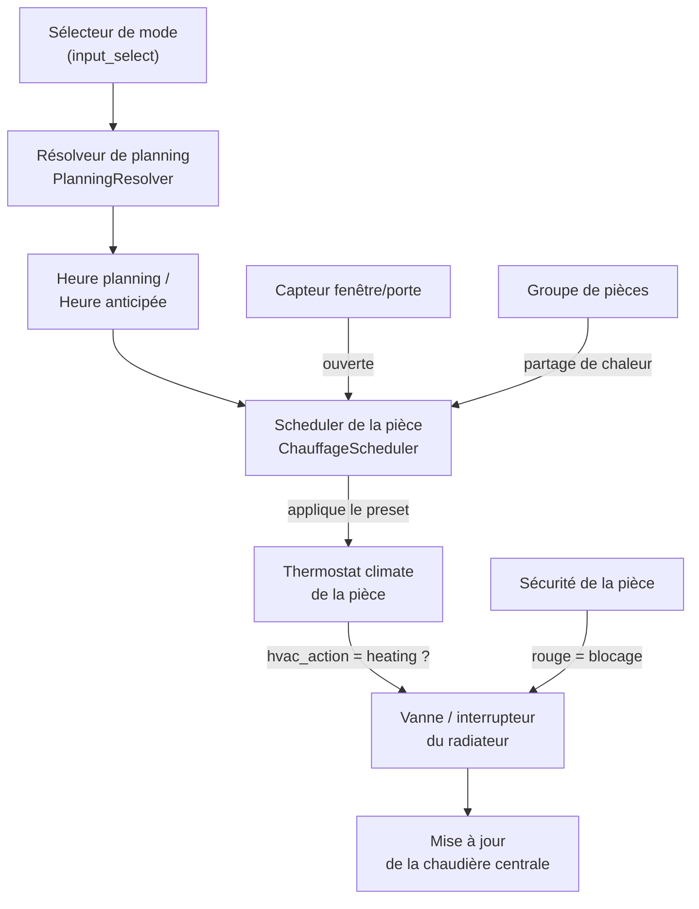

<div align="center">

# 🔥 Chauffage Intelligent

**Intégration Home Assistant pour un pilotage intelligent du chauffage, pièce par pièce**

[](https://github.com/hacs/integration)
[](https://www.home-assistant.io/)
[](https://github.com/Blondel76/chauffage-intelligent/releases)
[](LICENSE)
[](https://github.com/Blondel76/chauffage-intelligent/issues)

</div>

---

## 📖 Sommaire

- [Présentation](#-présentation)
- [Aperçu](#-aperçu)
- [Fonctionnalités](#-fonctionnalités)
- [Fonctionnement](#-fonctionnement)
- [Installation](#-installation)
- [Configuration](#-configuration)
- [Entités créées](#-entités-créées)
- [Groupes de pièces](#-groupes-de-pièces)
- [Sécurité](#-sécurité)
- [Exemples d'automatisations](#-exemples-dautomatisations)
- [FAQ](#-faq)
- [Contribuer](#-contribuer)
- [Licence](#-licence)

---

## 🧭 Présentation

**Chauffage Intelligent** est une intégration personnalisée pour [Home Assistant](https://www.home-assistant.io/) qui pilote le chauffage pièce par pièce (gaz ou électrique), en tenant compte :

- de la température intérieure/extérieure de chaque pièce,
- d'un **planning horaire par mode** (jour/nuit/absence/vacances...) piloté par un `input_select` central,
- d'un **coefficient d'inertie thermique auto-apprenant**, propre à chaque pièce,
- de l'**ouverture des fenêtres/portes** (coupure automatique du chauffage),
- d'un **partage de chaleur entre pièces reliées** (groupes de pièces ouvertes entre elles),
- d'une **supervision de sécurité en temps réel** par pièce,
- de la **régulation globale de la chaudière** en fonction des besoins réels des pièces.

> 💡 Pensé pour les logements chauffés au gaz (vannes/thermostats pilotés) comme à l'électrique (radiateurs pilotés par interrupteur), avec une configuration 100 % via l'interface Home Assistant — aucun YAML requis.

---

## 🖼️ Aperçu

<div align="center">

| Vue d'ensemble d'une pièce | Historique de la dérive thermique |
|:---:|:---:|
|  |  |

| Configuration centrale | Sécurité en temps réel |
|:---:|:---:|
|  |  |

</div>

> 🖊️ *Captures d'écran à venir — remplacez les fichiers dans `images/` par vos propres captures une fois vos cartes Lovelace en place.*

---

## ✨ Fonctionnalités

- 🏠 **Configuration par pièce** : chaque pièce a son propre thermostat, ses capteurs, son planning et son apprentissage.
- 🕓 **Plannings par mode** : autant de plannings que d'options dans votre sélecteur de mode (`input_select`), éditables directement dans l'intégration.
- 🧠 **Coefficient auto-apprenant** : le temps de chauffe estimé s'affine automatiquement à partir de la dérive de température réellement observée.
- ⏱️ **Anticipation du chauffage** : calcule l'heure de démarrage idéale pour atteindre la consigne pile à l'heure du planning.
- 🪟 **Coupure fenêtre/porte** : coupe le chauffage d'une pièce dès qu'une fenêtre/porte s'ouvre (capteur dédié ou interrupteur manuel).
- 🔗 **Groupes de pièces** : les pièces thermiquement ouvertes entre elles (ex. salon + cuisine ouverte) peuvent se réchauffer mutuellement.
- 🔥 **Chaudière centrale pilotée automatiquement** : ne tourne que si au moins une pièce a réellement besoin de chauffer.
- 🛡️ **Sécurité par pièce en temps réel** : un capteur `gris/vert/rouge` détecte immédiatement une panne (capteur indisponible, vanne coupée manuellement, chaudière HS...) et bloque le chauffage de la pièce concernée si besoin.
- 💧 **Aération & humidité** *(optionnel, si vos capteurs le permettent)* : recommandation d'aération basée sur l'humidité absolue intérieure/extérieure, et niveau d'humidité intérieure qualifié.
- 🧩 **100 % config flow** : ajout, modification et suppression des pièces, groupes et de la configuration centrale entièrement via l'UI.

---

## ⚙️ Fonctionnement



1. Le **sélecteur de mode** central (`input_select`) détermine quel planning est actif pour chaque pièce.
2. Le **résolveur de planning** (`PlanningResolver`) traduit le mode courant en planning horaire pour la pièce.
3. Le **scheduler** de la pièce applique le bon preset au thermostat à l'heure anticipée (calculée à partir du coefficient d'inertie).
4. Dès que le thermostat demande à chauffer (`hvac_action = heating`), le scheduler ouvre la vanne ou l'interrupteur du radiateur — sauf si la pièce est en **alarme sécurité rouge**, ou si une **fenêtre/porte est ouverte**.
5. Si une pièce **idle** est reliée à une pièce en train de chauffer via un **groupe**, elle peut en profiter pour se réchauffer si son écart à la consigne dépasse le seuil du groupe.
6. Le **capteur `derive`** mesure la vitesse réelle de montée en température, ce qui permet au **coefficient** de s'auto-ajuster pour affiner les prochaines estimations.
7. À chaque changement de pièce, la **chaudière centrale** est réévaluée : elle ne tourne que si au moins une pièce chauffe réellement (vanne/interrupteur ouvert).

---

## 📦 Installation

### Via HACS (recommandé)

1. Ouvrez **HACS** dans Home Assistant.
2. Menu **⋮** → **Dépôts personnalisés**.
3. Ajoutez `https://github.com/Blondel76/chauffage-intelligent` en catégorie **Intégration**.
4. Recherchez **Chauffage Intelligent** dans HACS et installez-le.
5. Redémarrez Home Assistant.

### Installation manuelle

1. Téléchargez la dernière release depuis [GitHub Releases](https://github.com/Blondel76/chauffage-intelligent/releases).
2. Copiez le dossier `chauffage_intelligent` dans `config/custom_components/`.
3. Redémarrez Home Assistant.

---

## 🛠️ Configuration

Toute la configuration se fait depuis **Paramètres → Appareils et services → Ajouter une intégration → Chauffage Intelligent**.

### 1. Configuration centrale *(obligatoire, une seule fois)*

| Champ | Description |
|---|---|
| Sélecteur de mode | `input_select` définissant les modes (Jour, Nuit, Absence...) |
| Type de chauffage | Gaz ou Électrique |
| Chaudière | Entité `switch` ou `climate` pilotant la chaudière *(optionnel si électrique)* |

### 2. Ajout d'une pièce

| Champ | Description |
|---|---|
| Zone (area) | Zone Home Assistant correspondant à la pièce |
| Température extérieure | Capteur de température extérieure |
| Température intérieure | Capteur de température de la pièce |
| Thermostat de la pièce | Entité `climate` de la pièce |
| Vanne ou interrupteur du radiateur | `climate` (vanne, chauffage gaz) ou `switch` (chauffage électrique) |
| Capteur de porte/fenêtre *(optionnel)* | Si absent, un interrupteur manuel `switch.fenetre_ouverte_<pièce>` est créé |

Puis, un planning est demandé **pour chaque mode existant** dans votre sélecteur, au format :

```
07h00|confort, 22h30|eco, 23h30|hors_gel
```

### 3. Ajout d'un groupe *(optionnel)*

Permet de relier des pièces thermiquement ouvertes (ex. cuisine ouverte sur le salon) afin qu'elles se réchauffent mutuellement.

| Champ | Description |
|---|---|
| Nom du groupe | Nom libre |
| Pièces du groupe | Sélection parmi les pièces déjà configurées |
| Seuil de température | Écart (°C) toléré avant de déclencher le partage de chaleur |

---

## 📊 Entités créées

### Par pièce

| Entité | Domaine | Description |
|---|---|---|
| `sensor.temps_de_chauffe_<pièce>` | sensor | Temps de chauffe estimé (min) |
| `sensor.derive_<pièce>` | sensor | Vitesse de variation de température (°C/min) |
| `sensor.heure_planning_<pièce>` | sensor | Prochain créneau du planning actif |
| `sensor.heure_planning_precedent_<pièce>` | sensor | Créneau précédent du planning actif |
| `sensor.heure_anticipee_<pièce>` | sensor | Heure de démarrage anticipée du chauffage |
| `sensor.securite_<pièce>` | sensor | État de sécurité : `gris` / `vert` / `rouge` |
| `sensor.aeration_<pièce>` | sensor | Recommandation d'aération *(si capteurs d'humidité disponibles)* |
| `sensor.humidite_<pièce>` | sensor | Niveau d'humidité intérieure *(si capteur d'humidité disponible)* |
| `number.coefficient_<pièce>` | number | Coefficient d'inertie thermique, auto-appris |
| `switch.fenetre_ouverte_<pièce>` | switch | Interrupteur manuel *(si aucun capteur de porte/fenêtre configuré)* |

### Globales

| Entité | Domaine | Description |
|---|---|---|
| `switch.chauffage_general` | switch | Interrupteur maître : coupe/active le chauffage de toutes les pièces |

---

## 🔗 Groupes de pièces

Un groupe permet à une pièce **idle** (qui n'a pas besoin de chauffer selon sa propre consigne) de profiter de la chaleur d'une pièce voisine **en train de chauffer**, tant que l'écart entre sa température et sa consigne dépasse le seuil défini pour le groupe. Idéal pour les espaces ouverts (cuisine américaine, mezzanine, couloir non cloisonné...).

---

## 🛡️ Sécurité

Chaque pièce dispose d'un capteur `sensor.securite_<pièce>` recalculé **en continu**, sans latch ni réarmement :

| État | Signification |
|---|---|
| 🔘 **Gris** | Chauffage éteint pour la pièce (normal, pas d'alerte) |
| 🟢 **Vert** | Tout fonctionne normalement |
| 🔴 **Rouge** | Problème détecté — le chauffage de la pièce est **automatiquement bloqué** |

Le passage au rouge est déclenché par :
- un capteur de température (int/ext) introuvable ou indisponible,
- une vanne/interrupteur du radiateur introuvable, indisponible, ou coupée manuellement alors que le chauffage devrait être actif,
- une chaudière centrale introuvable ou indisponible.

---

## 🤖 Exemples d'automatisations

**Notifier en cas d'alerte sécurité sur une pièce :**

```yaml
automation:
  - alias: "Alerte sécurité chauffage"
    trigger:
      - platform: state
        entity_id: sensor.securite_salon
        to: "rouge"
    action:
      - service: notify.mobile_app
        data:
          title: "⚠️ Chauffage salon"
          message: "Problème détecté, le chauffage a été coupé automatiquement."
```

**Notifier une recommandation d'aération :**

```yaml
automation:
  - alias: "Aération recommandée"
    trigger:
      - platform: state
        entity_id: sensor.aeration_salle_de_bain
        to: "Aération recommandée"
    action:
      - service: notify.mobile_app
        data:
          message: "Pensez à aérer la salle de bain 🪟"
```

---

## ❓ FAQ

**Puis-je utiliser cette intégration sans chaudière centrale ?**
Oui — laissez le champ « Chaudière » vide dans la configuration centrale (typiquement en chauffage électrique).

**Que se passe-t-il si je n'ai pas de capteur d'humidité ?**
Les capteurs `Aération` et `Humidité` passent simplement à l'état `unknown` ; le reste de l'intégration fonctionne normalement.

**Puis-je modifier le planning d'une pièce après coup ?**
Oui, via **Configurer** sur l'entrée de la pièce concernée dans la liste des intégrations.

---

## 🤝 Contribuer

Les contributions sont les bienvenues !

1. Forkez le dépôt
2. Créez une branche (`git checkout -b feature/ma-fonctionnalite`)
3. Commitez vos changements
4. Ouvrez une **Pull Request**

Pour signaler un bug ou proposer une idée, utilisez les [Issues GitHub](https://github.com/Blondel76/chauffage-intelligent/issues).

---

## 📄 Licence

Distribué sous licence indiquée dans le fichier [LICENSE](LICENSE).

---

<div align="center">

Développé avec ❤️ pour la communauté Home Assistant francophone

</div>
